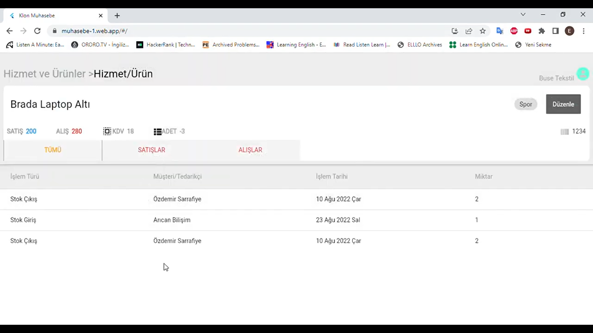
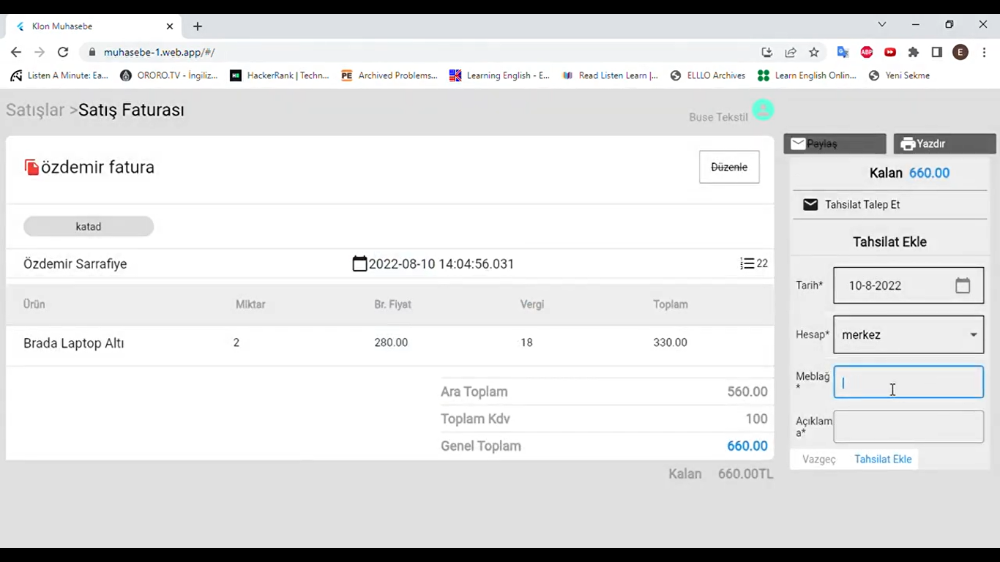

# Ön Muhasebe Web Uygulaması

Bu uygulama ön muhasebe programının temel modüllerini içerir.Paraşüt uygulamasının klonudur.Eğitim amaçlı yapılmıştır.Hiçbir şekilde ticari amaç için kullanılamaz.

- Bu uygulamanın demo videosuna erişmek için https://www.youtube.com/watch?v=5-wpfItP30s
- Bu uygulamanın front-end kodlarına erişmek için https://github.com/emirvur/parasut_web_muhasebe_clone_frontend
- Back-end kodlarına erişmek için https://github.com/emirvur/parasut_web_muhasebe_clone_backend

## Özellikler

- [x] Satış Modülü
- [x] Gider Modülü
- [x] Kasa Modülü
- [x] Rapor Modülü
- [x] İrsaliye
- [x] Rapor mail gönderme
- [] Çek-Senet Modülü
- [] E-Fatura Entegrasyonu

